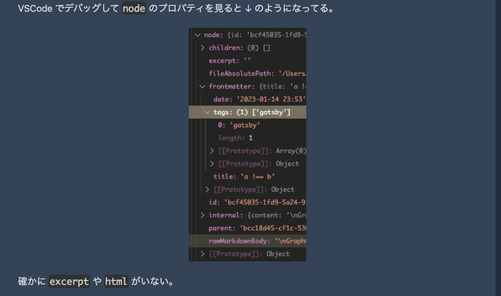
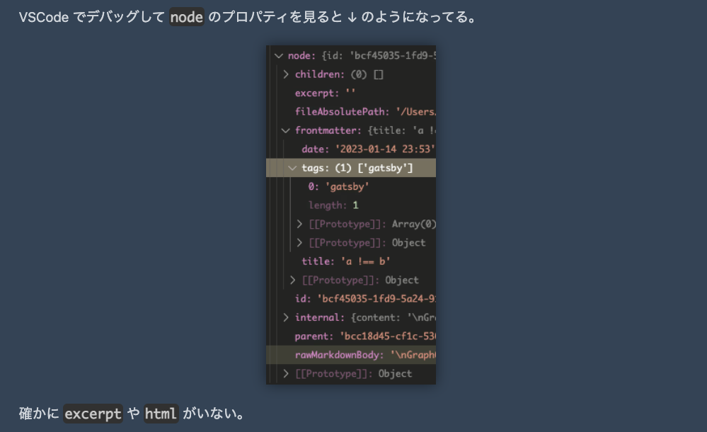

[@tailwindcss/typography](https://tailwindcss.com/docs/typography-plugin)
はMarkdown記事をｻｸｯとスタイリングするのに素晴らしいツール。

ただ、そのままだと画像に影がついてないのが気に入らない。
ので、影をつける方法をメモる。

<!-- more -->

先に結果を見せる。
影がついてないのが ↓。



影がついてるのが ↓。



影をつけるには、
`tailwind.config.js` の `module.exports` を ↓ のようにいじれば良い。

```js
  theme: {
    extend: {
      typography: {
        DEFAULT: {
          css: {
            ".gatsby-resp-image-wrapper": {
              "box-shadow": "0 0 1rem rgba(0, 0, 0, 0.5)",
            },
          },
        },
      },
    },
  },
```

`box-shadow` のパラメータは
[MDN の doc](https://developer.mozilla.org/en-US/docs/Web/CSS/box-shadow)
でも見て。
`blur-radius` の単位が `rem` で良いのかは悩みどころ。
環境によって見た目が変わっちゃう...のか ❓
`px` のが良い ❓
分からん。

`<span class="gatsby-resp-image-wrapper">` は
[gatsby-plugin-image](https://www.gatsbyjs.com/plugins/gatsby-plugin-image/)
が生成する。
`<span>` じゃない可能性もあるので selector は `.gatsby-resp-image-wrapper` にしておいた。

`` や `<picture>` を指定しても NG。
gatsby-plugin-image によって`<span>` などにラップされるので、
`box-shadow` を付与しても見えない。

当然だけど、gatsby-plugin-image 以外の環境では期待通りにならない。
適宜読み替えること。

サイト内の markdown 記事以外の画像には影響しない。
Typography の影響下( `class="prose"` を指定した要素以下)にある画像だけ影がつく。
