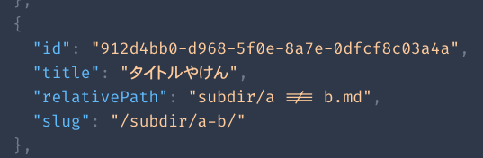
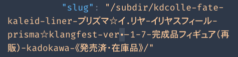

GraphQL エディタ( `http://localhost:8000/___graphql` )は
Fira Code フォントを使っている。

`a !== b.md` などを表示させると、↓ のように `≠` みたいなレンダリング結果になる。

ちなみに発端は ↓ の画面。

`ver.-` のピリオドが `・` (中点)みたいに見える。

`kebabCase()` の設計実装をしたばっかだったから、
てっきりそっちのバグかと思って焦った...。
