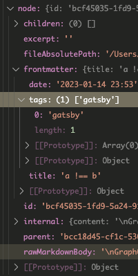

例えば、 `gatsby-transformer-remark` を使っていると、
↓ のプロパティなどがあることが分かる。

- `markdownRemark`
  - `excerpt`
  - `fileAbsolutePath`
  - `frontmatter`
    - `date`
    - `description`
    - `tags`
    - `title`
  - `html`
  - `id`

実際に試したい人は `gatsby develop` して、
GraphQL の Playground(<http://localhost:8000/___graphql>)にアクセスしてね。

で、これらのプロパティの中には、
`gatsby-node.js` の `onCreateNode()` 時にはまだ生成されてないものがある。

<!-- more -->

`excerpt` や `html` なんかがそれ。

```js
exports.onCreateNode = ({ node }) => {
  if (node.internal.type === `MarkdownRemark`) {
    console.log(node.frontmatter.title);
    // output: "title of post"
    console.log(node.html);
    // output: undefined
  }
};
```

VSCode でデバッグして `node` のプロパティを見ると ↓ のようになってる。



確かに `excerpt` や `html` がいない。

これで困るのは、GraphQL の型定義をするとき( `createSchemaCustomization()` するとき)。

例えば、Markdown の post 用の GraphQL の型定義をするとき、
↓ のように Node を作って、

```js
exports.onCreateNode = ({
  node,
  actions,
  createNodeId,
  createContentDigest,
}) => {
  const { createNode } = actions;
  if (node.internal.type === `MarkdownRemark`) {
    const fieldData = {
      title: node.frontmatter.title,
      date: node.frontmatter.date,
      html: node.html, // ←ここが `undefined`
    };

    const id = createNodeId(`${node.id} >>> MarkdownPost`);

    createNode({
      ...fieldData,
      // Required fields
      id: id,
      parent: node.id,
      children: [],
      internal: {
        type: `MarkdownPost`,
        contentDigest: createContentDigest(fieldData),
        content: JSON.stringify(fieldData),
        description: `MarkdownPost`,
      },
    });
  }
};
```

↓ のように型定義すると、エラーになる。

```js
exports.createSchemaCustomization = ({ actions }) => {
  const { createTypes } = actions;

  const typeDefs = `
    type MarkdownPost implements Node {
      title: String!
      date: Date! @dateformat
      html: String!
    }
  `;
  createTypes(typeDefs);
};
```

`createNode()` するときには、 `html` がまだ `undefined` なため。
なお、厳密には、 `MarkdownPost.html` を query した瞬間にエラーになる。

困ったのでググってたら、
[gatsby-theme-minimal-blog](https://github.com/LekoArts/gatsby-themes/blob/main/themes/gatsby-theme-minimal-blog-core/gatsby-node.js)
のソースに解決策があった。

まず `createNode()` するときには `html` を渡さないようにする。

```js
exports.onCreateNode = ({
  node,
  actions,
  createNodeId,
  createContentDigest,
}) => {
  const { createNode } = actions;
  if (node.internal.type === `MarkdownRemark`) {
    const fieldData = {
      title: node.frontmatter.title,
      date: node.frontmatter.date,
      // html: node.html, // ←ここが `undefined`
    };

    const id = createNodeId(`${node.id} >>> MarkdownPost`);

    createNode({
      ...fieldData,
      // Required fields
      id: id,
      parent: node.id,
      children: [],
      internal: {
        type: `MarkdownPost`,
        contentDigest: createContentDigest(fieldData),
        content: JSON.stringify(fieldData),
        description: `MarkdownPost`,
      },
    });
  }
};
```

で、 `createTypes()` 用の定義を ↓ のようにして、
`createFieldExtension()` を追加する。

```js
exports.createSchemaCustomization = ({ actions }) => {
  const { createFieldExtension, createTypes } = actions;

  const typeDefs = `
    type MarkdownPost implements Node {
      title: String!
      date: Date! @dateformat
      html: String! @markdownpassthrough(fieldName: "html")
    }
  `;
  createTypes(typeDefs);

  createFieldExtension({
    name: `markdownpassthrough`,
    args: {
      fieldName: `String!`,
    },
    extend({ fieldName }) {
      return {
        resolve: markdownResolverPassthrough(fieldName),
      };
    },
  });
};
```

`markdownResolverPassthrough()` は ↓ みたいにする。

```js
const markdownResolverPassthrough =
  (fieldName) => async (source, args, context, info) => {
    const type = info.schema.getType(`MarkdownRemark`);
    const markdownNode = context.nodeModel.getNodeById({
      id: source.parent,
    });
    const resolver = type.getFields()[fieldName].resolve;
    const result = await resolver(markdownNode, args, context, info);
    return result;
  };
```

1 行単位で何やってるまでは分からんかったｗ

まぁ、大事なのは、GraphQL には、
Node 作成時に値が入ってるプロパティと
Query 時に(必要になったときに)値を作成するプロパティがあることか。

で、Query 時に生成する仕組みを実現するのが、
`createTypes()` の
`@markdownpassthrough(fieldName: "html")`
であり、
`createFieldExtension()`
であり、
`markdownResolverPassthrough()`
であるってことだね。

とりあえず今は ↑ の理解でとどめておく。
もっと詳細に理解したい場合は、GraphQL のアーキテクチャを知る必要があると思う。
そこまでの体力はなかった...。
