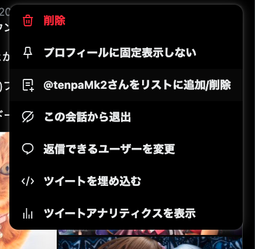
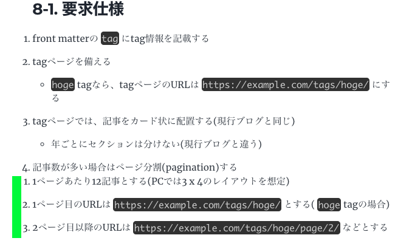

## 1. 要求仕様をまとめたい

### 1-1. 要求仕様

1. この markdown 自体を要求仕様書とする。
2. 仕様番号を自動でつけるのはなし
   - 思ったより面倒そうだったので。
3. 設計書はある程度の塊で別記事に分けて、
   この仕様書からはリンクするだけにする。
   - 記事が長くなりすぎるため

## 2. 画像の運用方法を決めたい

### 2-1. 説明

hexo と違って、gatsby ではユーザに画像をそのまま DL させることはしないのが通例。
ユーザの環境に最適なサイズの画像のみを DL させるようにする。

そのために、オリジナルの画像から低解像度の画像をビルド時に生成するようにしている。
これをするかしないか決めたい。

### 2-2. 要求仕様

1. 低解像度の画像生成はする
   1. 解像度の刻みは gatsby-remark-images のデフォルトのままとする
   2. オリジナル画像(サイズそのままの画質劣化版)へのリンクは貼る
   3. 画質は quality 80 とする
      - そこそこキレイで、サイズも小さいので
2. オリジナル画像は Lightroom から ↓ の設定で書き出す
   1. 形式: jpg
   2. 解像度: 長編 2048px ( `寸法 小` )
   3. 画質: 90%
   4. 透かしは左下

### 2-3. 検討

gatsby-remark-images との挙動を調べた。

低解像度の画像生成はデフォルトでするようになっている。
というか無効にする方法を知らない...。

オリジナル画像を元に、
あらかじめ指定したサイズごとに縮小した画像が自動でビルド時に生成される。

生成先は `public/static/` 以下。ランダム文字列のディレクトリ(URL)を経た先に生成される。
なお、ブログ作成者がこの URL を意識することはない。
自動生成した URL を gatsby-remark-images が自動で html に組み込んでくれる。

html では、ユーザのデバイスの画面サイズに適したサイズの画像を DL するように
`picture` タグがいい感じに作られる ↓。

```html
<a
  class="gatsby-resp-image-link"
  href="/static/12b82f427e8fbe978fab3b95748bc318/8fe94/DSC03542.jpg"
  style="display: block"
  target="_blank"
  rel="noopener"
>
  <span
    class="gatsby-resp-image-background-image"
    style='padding-bottom: 56.4444%; position: relative; bottom: 0px; left: 0px; background-image: url("data:image/jpeg;base64,/9j/2wBDABALDA4MChAODQ4SERATGCgaGBYWGDEjJR0oOjM9PDkzODdASFxOQERXRTc4UG1RV19iZ2hnPk1xeXBkeFxlZ2P/2wBDARESEhgVGC8aGi9jQjhCY2NjY2NjY2NjY2NjY2NjY2NjY2NjY2NjY2NjY2NjY2NjY2NjY2NjY2NjY2NjY2NjY2P/wgARCAALABQDASIAAhEBAxEB/8QAFwABAQEBAAAAAAAAAAAAAAAAAwABBP/EABQBAQAAAAAAAAAAAAAAAAAAAAH/2gAMAwEAAhADEAAAAeLGFSjg/8QAGxAAAQQDAAAAAAAAAAAAAAAAAwABAiMEERL/2gAIAQEAAQUCEOoELSD1LDQHtK79f//EABURAQEAAAAAAAAAAAAAAAAAAAEQ/9oACAEDAQE/AWf/xAAVEQEBAAAAAAAAAAAAAAAAAAABEP/aAAgBAgEBPwEn/8QAGhAAAgMBAQAAAAAAAAAAAAAAAAECETEiQf/aAAgBAQAGPwJuSLeJnMbK8Gaf/8QAGxABAAIDAQEAAAAAAAAAAAAAAQARIUFhUZH/2gAIAQEAAT8hNeUllTVMKnsbIj2Jp2GSIFeFm3fez//aAAwDAQACAAMAAAAQuC//xAAXEQADAQAAAAAAAAAAAAAAAAABEBEx/9oACAEDAQE/EMCL/8QAFhEAAwAAAAAAAAAAAAAAAAAAARBR/9oACAECAQE/EAq//8QAHhABAAICAgMBAAAAAAAAAAAAAREhADFRgUFhsdH/2gAIAQEAAT8QXGBUVJ8cYItsBmWQEZA0hKBtV+a6y0bfs1+4cbFepi8MIOnS5Z//2Q=="); background-size: cover; display: block; transition: opacity 0.5s ease 0.5s; opacity: 0;'
  ></span>
  <picture>
    <source
      srcset="
        /static/12b82f427e8fbe978fab3b95748bc318/d3872/DSC03542.webp  225w,
        /static/12b82f427e8fbe978fab3b95748bc318/8a5f6/DSC03542.webp  450w,
        /static/12b82f427e8fbe978fab3b95748bc318/90807/DSC03542.webp  900w,
        /static/12b82f427e8fbe978fab3b95748bc318/cad0f/DSC03542.webp 1350w,
        /static/12b82f427e8fbe978fab3b95748bc318/a2303/DSC03542.webp 1800w,
        /static/12b82f427e8fbe978fab3b95748bc318/7c4f2/DSC03542.webp 2048w
      "
      sizes="(max-width: 900px) 100vw, 900px"
      type="image/webp"
    />
    <source
      srcset="
        /static/12b82f427e8fbe978fab3b95748bc318/275f3/DSC03542.jpg  225w,
        /static/12b82f427e8fbe978fab3b95748bc318/d3a3a/DSC03542.jpg  450w,
        /static/12b82f427e8fbe978fab3b95748bc318/2ee6c/DSC03542.jpg  900w,
        /static/12b82f427e8fbe978fab3b95748bc318/4501f/DSC03542.jpg 1350w,
        /static/12b82f427e8fbe978fab3b95748bc318/8b34c/DSC03542.jpg 1800w,
        /static/12b82f427e8fbe978fab3b95748bc318/8fe94/DSC03542.jpg 2048w
      "
      sizes="(max-width: 900px) 100vw, 900px"
      type="image/jpeg"
    />
    
  </picture>
</a>
```

また、画像形式ごとに変わる挙動もある。

jpg と webp だと、 **オリジナル画像へのリンクが貼られない** 。
config で `linkImagesToOriginal` を `true` にするとリンク( `a` タグ)はできるけど、
リンク先がなぜかエンコード済みの画像になっちゃう(解像度はオリジナル)。
要は劣化した画像にリンクされる。

png と tiff だと、ちゃんとオリジナル画像へリンクが貼られる。不思議。
どちらの画像形式も、解像度そのままで画質を落とすのが難しいからかな ❓

~~ひとしきり悩んだけど、必ずしもオリジナル画像にリンクを貼る必要はないと判断。~~
~~むしろ、無断転載対策としてはオリジナル画像は DL できないほうが良いかとすら思えてきた。~~
~~今見てるデバイスに十分なサイズの画像が DL されてるんだし、それで良くね ❓~~
いやーでも、横長画像はやっぱクリックしてでかい画面で見たいか。
記事の状態で表示してると、メイン領域の幅に制限されちゃって、
見づらいように思えてきた。
やっぱりリンクは貼ろう。

ついでにいうと、AVIF のサポートする場合でも、リンク先は jpg(劣化してるけど)になるので安心。
なぜか、AVIF 単体を開こうとすると、表示されずにファイルの DL が開始されちゃうんだよね。
html の中で画像表示してる分には表示できるのに...不思議。

エンコード先の画質は quality 80 くらいで良いんでない ❓
十分キレイだよ。

ここから、Lightroom の設定を検討する。

まず、形式は jpg で良いか。
png は repository の管理の観点からサイズが重すぎて NG。
あと、イラストじゃなく写真で png って普通使わないでしょ。
tiff もだめ。そもそもブラウザで表示できない
(リンククリックした瞬間に DL マネージャー行き)。

解像度は長編 2048[px]。 `寸法 小` を選べばよいだけなので設定が楽ちん。
記事の表示領域が FHD(1920px)ぐらいある人にとってもちょうど良いはず。
4K とか retina の人は無視。

画質は 90%と 100%で悩むな...。
再々エンコードすることになるので、なるべく 100%のほうが良いか。
けど、サイズは 2 倍近く変わる。
それに、ぶっちゃけ違いが分からん。
そう考えるとコスパ悪いな。一旦 90%にするか。

おまけ。

縮小画像の自動生成をしない場合は、
`/static/` に画像を置いて、markdown からそこを参照すれば良い。
この場合、シンプルな `<picture>` じゃなくて `` になる。

### 2-4. 設計

なし。運用決めただけ。

## 3. AVIF サポートしたい

### 3-1. 要求仕様

1. AVIF サポート環境では AVIF を DL して表示させる
   - やっぱ時代は AVIF でしょって気持ちが半分あるため。
   - もう半分はやっぱりページの表示速度のため。
2. 低解像度の画像生成などの仕様は
   [『2. 画像の運用方法を決めたい』](#2-画像の運用方法を決めたい)
   に従う。

### 3-2. 設計

なんかオプション一発でできるっぽい。
`gatsby-remark-images` の
[公式 doc](https://www.gatsbyjs.com/plugins/gatsby-remark-images/)
によると、config で `withAvif` を `true` にすれば良いらしい。

## 4. URL とディレクトリ構造とファイル名を決めたい

### 4-1. 説明

おそらくブログの運用の煩雑さの大半を決める要素だと思う。
先にキッチリ決めてから運用開始したい。

あと、現行記事は URL の互換性を取りたい(現行ブログと同じ URL にしたい)。
外部サイトさんにしてもらってるリンクを切らしたくない。

### 4-2. 要求仕様

新記事も現行記事も ↓ とする。

1. markdown のファイル名は記事タイトルにする
2. markdown は `content/blog/` に、画像は `content/blog/images/` にまとめて投げる

このとき、URL は `https://example.com/記事タイトル/` にする。
markdown から画像にリンクするには
~~`[image](/images/figure.jpg)` とする。~~
これだめだ。相対パスじゃないとダメっぽい。
`[image](./images/figure.jpg)` とする。

現行記事のみ、front matter の `slug` を追加し、URL を文字列として指定する。
記事の URL は `slug` の値にする。

### 4-3. 既存仕様

まず、gatsby(gatsby-starter-blog)の既存仕様(挙動)を知るのが大事。
調べたところ、現状は ↓ のようになってる。

1. ディレクトリ構造がそのまま URL になる
2. ファイル名が `index.md` だと、親ディレクトリまでのパスが URL になる
   - `/content/blog/hoge/index.md` なら `https://example.com/hoge/` が記事 URL
3. ファイル名が `index.md` 以外だと、そのファイルまでのパスが URL になる
   - `/content/blog/hoge/fuga.md` なら `https://example.com/hoge/fuga/` が記事 URL

また、gatsby のサイトを見てると ↓ のような運用もできるようだ。

1. markdown の front matter の `slug` 要素から URL を決定

ただし、gatsby-starter-blog のデフォルト状態だと ↑ の挙動にはならない。
設計変更が必要。

### 4-4. 検討

#### 4-4-1. 既存記事と新記事

既存記事と新記事とで、満たすべき仕様が異なる。
既存記事は現行ブログと同じ URL から閲覧できなくてはいけない。
性質が異なるので運用を変えるべき。

#### 4-4-2. 新記事の運用検討

まず、ファイル名は `index.md` 以外にしよう。
VSCode の `ctrl + p` で検索しやすいのは大きい。

続いて、md ファイルと画像のディレクトリをどうするか。

1. markdown は `content/blog/posts/` に、画像は `content/blog/images/` にまとめて投げる
   - ディレクトリ名は何でも良いや。ここでは ↑ とする。
2. 日付ごとにディレクトリを分けて、markdown と画像はそこに投げる

観点は ↓。

1. ファイルが増えてきたときに困らないか
2. 記事間のリンクが簡潔に貼れるか
3. 記事から画像にリンクするときのパスが複雑にならないか

まず、候補 1。

ファイルが増えたときに困るかは、困らん。
現行ブログは候補 1 の状態で 88 ファイル(記事)あるけど、別に困ってないしね。
たとえ 200 記事になっても問題ない気がする。

記事間のリンクは簡潔に貼れる。
ルート相対パスだったとして、 `[link](/ファイル名/)` って書くだけでしょ。

画像へのリンクも問題ない。
~~`[image](/images/figure.jpg)` とするだけ。~~
やってみたらダメだった。 `/content/blog/` がルートになるわけじゃないっぽい。
相対パスなら大丈夫だった。
`[image](./images/figure.jpg)` にしよう。

多分、ルート相対パスでも書けると思うんだけど、ルートがどこなのか分からん...。

あと、これは markdown が `/content/blog/` に配置されてることが前提。
階層が深くなると相対パスの書き直しになるので注意。

続いて、候補 2。

ファイルが増えると、ディレクトリだらけになって煩雑になる。
年月日それぞれでディレクトリを分けるとして、フォルダがいくつできるやら。
あまり良い印象はない。

記事間のリンクも日付が入る分、複雑になる。

画像へのリンクは一番簡単になる。
記事と同一ディレクトリに画像があるので、
相対パスで `[image](./figure.jpg)` って書ける。
う〜ん、でもルート相対パスに比べてメリットがあるかって言われると...あんまないよな。

総合すると候補 1 のほうが良いと判断。

#### 4-4-3. 既存記事の運用検討

既存記事のファイル名は `記事タイトル.md` になっている。
これは変えたくない。面倒なので。

markdown は `source/__post/` に配置されているが、
URL は例えば `https://example.com/2022/12/17/記事タイトル/` などにする必要がある。

シンプルに考えると、ファイル名はそのまま、日付ごとのディレクトリを作って、
`content/blog/2022/12/17/記事タイトル.md` とかにすれば良さそう。

ただ、新記事の markdown は `content/blog/` に配置される予定なので、
統一感が出ないよな。

あと、現行ブログは 88 記事あるので、日付ディレクトリも 88 記事分必要になる。
煩雑だよなあ。

これらの解決策は、front matter の `slug` で URL を決めることか。
これなら既存記事の markdown は `content/blog/` に置ける。
ただ、 `slug` に対応させるための設計変更が必要。

もう一個解決策があるとすれば、リダイレクトを設定することか。
メインの URL は `https://example.com/既存記事タイトル/` なんだけど、
旧 URL の `https://example.com/2022/12/17/既存記事タイトル` にアクセスしたら、
メインの URL にリダイレクトするようにすれば良い。

### 4-5. 設計

front formatter の `slug` を URL にする処理だけ設計が必要。
WIP.

### 4-6. メモ

「 `content/blog/hoge.md` の URL が `https://example.com/hoge/` になるんだから、
画像は `` のルート相対パスでリンクできるでしょ」
って思ってたらできなかった。

[公式 doc](https://www.gatsbyjs.com/docs/how-to/images-and-media/working-with-images-in-markdown/#configuring-for-images-and-posts-in-different-directories)
にできるっぽく書いてあるが、よく読むと違う。

> ## Configuring for images and posts in different directories
>
> There are also occasions when you may want to source images from a different directory than where your markdown posts or pages are located, such as in an external `/images` folder. You can set this up by specifying two distinct sources, one for the markdown files and the other for images:

これはどのディレクトリを管理下に置くか、という設定であって、
ルート相対パスのルートを決める設定ではない...。

## 5. canonical link を設定したい

### 5-1. 要求仕様

1. canonical link を設定する
   1. 記事ごとの URL をパーセントエンコーディングしたもので設定する
2. 現行記事は既に設定されている canonical link を引き継ぐ

### 5-2. 設計

設計要るかも。
もし必要なら、現行記事の canonical link だけ front matter に書くようにしようか...(要求仕様追加)。

## 6. ページ分割(pagination)したい

### 6-1. 要求仕様

現行ブログと同じにする ↓。

1. 1 ページごとに 10 記事とする。。
2. 1 ページ目の URL は `https://example.com/` とする(TOP アドレスと同じにする)。
3. 2 ページ目以降の URL は `https://example.com/page/2` とする。
4. いわゆる『次ページ』とか『前ページ』とか基本的なナビゲーションを備える。

### 6-2. 設計

[公式 doc](https://www.gatsbyjs.com/docs/adding-pagination/)
に記述あり。

WIP。

## 7. ページ分割したページ(top ページ含む)での記事の見え方を決めたい

### 7-1. 要求仕様

現行ブログと同じでなくても良い。

1. 記事はメイン領域の横幅いっぱいに縦 1 列で並べる。
2. タイトルと画像と本文要約を表示する。
3. 『続きを読む』 or 『Read More』 ボタンを設けて、クリックしたら記事ページに飛ぶ。
4. tag 表示する。
5. share ボタンは表示しない。
   - なるべくスッキリさせたいので不要。記事ページ側で share できれば十分。

### 7-2. 設計

WIP.

## 8. tag 対応したい

### 8-1. 要求仕様

1. front matter の `tag` に tag 情報を記載する
2. tag ページを備える
   - `hoge` tag なら、tag ページの URL は `https://example.com/tags/hoge/` にする
3. tag ページでは、記事をカード状に配置する(現行ブログと同じ)
   - 年ごとにセクションは分けない(現行ブログと違う)
4. 記事数が多い場合はページ分割(pagination)する
   1. 1 ページあたり 12 記事とする(PC では 3 x 4 のレイアウトを想定)
   2. 1 ページ目の URL は `https://example.com/tags/hoge/` とする( `hoge` tag の場合)
   3. 2 ページ目以降の URL は `https://example.com/tags/hoge/page/2/` などとする

### 8-2. 設計

front matter の key が増えること自体に対しては新規設計は不要。
GraphQL に自動で認識させれるようだ。すごい。
GraphQL を使う段階では、ただ query に `tag` を指定すれば OK。

```graphql
query MyQuery {
  allMarkdownRemark {
    nodes {
      frontmatter {
        title
        tags
      }
    }
  }
}
```

ちなみに、仮に tag がない記事があると、query 結果の `tag` key 要素が `null` になる。

```js
{
  "data": {
    "allMarkdownRemark": {
      "nodes": [
        {
          "frontmatter": {
            "title": "New Beginnings",
            "tags": null
          }
        },
        {
          "frontmatter": {
            "title": "フィギュアレビュー「荻原沙優」グッドスマイルカンパニー",
            "tags": [
              "フィギュア",
              "フィギュアレビュー",
              "荻原沙優",
              "グッドスマイルカンパニー",
              "ひげを剃る。そして女子高生を拾う。"
            ]
          }
        }
      ]
    }
  },
  "extensions": {}
}
```

tag を表示するページの生成用の jsx で、
front matter の `tag` を拾えるように query を変える必要がある。

tag ページ自体は動的生成する。
`gatsby-node.js` をいじるのだ。

## 9. (欠番)

ミスった。

## 10. tag クラウドを表示したい

### 10-1. 説明

hexo のあれと一緒。もうちょっと改善したい。

### 10-2. 要求仕様

1. 記事数の多い tag ほど大きく、少ない tag ほど小さく表示する
2. 色付け...は不要
3. hexo のやつより大小の差を大きくする
   - hexo のは差が分かりづらい

表示場所とかは別で決める。

## 11. Author を表示したい

### 11-1. 説明

承認欲求モンスターになりたい。

というのは半分冗談としても、
Author アイコンと twitter へのリンクくらいは合ったほうが良くね ❓

### 11-2. 要求仕様

Author 表示する。

1. アイコン表示する
   1. いつもの赤いバン君で良いか
2. Twitter と Instagram のリンクを表示する
   1. できればアイコン付きのイケてるボタンにする

### 11-3. 設計

WIP.

## 12. アーカイブページ対応したい

### 12-1. 説明

現行ブログでいう `https://example.com/archives/2022/05/` とかのページのこと。

### 12-2. 要求仕様

1. ページは年ごとに作成する
2. 表示内容は [tag 対応](#8-tag対応したい) の仕様に準拠する

### 12-3. 検討

「要るか ❓ これ...」と思ったが、
確かアクセス履歴があったような気がするので残す。
あと、 [tag ページ](#8-tag対応したい) で年ごとに
セクション分けるのをやめるつもりなので、
アーカイブページが別途あったほうが良いなぁと思う。

ただし、作成は年ごとの単位にする。
月ごとだと、多くて 2, 3 記事しかないでしょ。無駄だと思う。

月ごとのページがなくなるので、互換性はなくなることになる。
が、ここは許容して良いでしょ。
外部からリンクされてるわけでもないしね。

### 12-3. 設計

WIP.
これも動的生成だなあ。

## 13. アーカイブ一覧を表示したい

### 13-1. 説明

hexo のあれと一緒。
[アーカイブページ対応](#12-アーカイブページ対応したい)
の仕様も参照。

### 13-2. 要求仕様

1. 年ごとのアーカイブページへのリンクを表示する。
2. 月ごとのリンクはなし
3. その年に該当する記事数を表示したい
   - よく考えたら普通のブログってこれやってるよな。hexo でなんでなかったんだろう。

### 13-3. 設計

WIP.

## 14. 最近の投稿欄を表示したい

### 14-1. 説明

hexo のあれ。
使ってる人もいる気がする(アクセス解析をしっかり調べないと分からないけど。

### 14-2. 要求仕様

1. 最新 5 件を一覧表示する
   - tag は問わない( `フィギュア` tag がついた最新 10 件を表示するとかはしない)

## 15. サイトのレイアウトを決めたい

言葉で書きづらい(暇があったらお絵描きする)。
現行ブログを踏襲するつもり。

1. デバイス(画面サイズ)共通の仕様
   1. 上から順に ↓ を表示する
      1. nav バー
      2. ブログヘッダ画像とブログタイトル
      3. メインコンテンツ
      4. フッタ(copyright と gatsby 表示)
2. PC のとき
   1. メイン領域とサイドペインを横に並べる
3. スマホのとき
   1. メイン領域の下にサイドペインを回り込ませる
   2. サイドペインの内容は縦に並べる

## 16. ダークテーマ対応したい

1. ダークテーマだけでも良い。
   - 白黒 2 パターン用意してると写真の印象変わりそうなのも怖いので。
2. 目に優しい色にする。
   1. コントラストがキツイのは NG。
3. 写真に余計な印象を与えない色にする。
   1. 基本グレー系か、色をつけたとしても彩度が極めて低い色にする。

配色ごとどっかからパクりたいな。
[tailwind の HP](https://tailwindcss.com/)みたいな配色に憧れるぅ。

## 17. twitter のツイートを埋め込めるようにしたい

### 17-1. 要求仕様

↓ の手順で埋め込むこととする。

1. twitter で『ツイートを埋め込む』を選択
   - 
2. 表示される embed 用コードをコピー
3. markdown にコピペ
4. `<script>` は消す。

### 17-2. 設計

[gatsby-plugin-twitter](https://www.gatsbyjs.com/plugins/gatsby-plugin-twitter/)
を使う。

インストールしたら config で有効化するだけ。オプションなどはなし。

hexo でいう `` みたいな記法を
使うものは見つからなかった。
gatsby は「markdown なんだし html タグを直接書けばいいじゃん」という文化のようだ。

## 18. ogp カード対応したい

1. twitter でフィギュアレビュー記事をツイートしたときに OGP 表示する
   1. 画像はなるべく大きく
      - 現行ブログの OGP はなんか小さい気がする。もっと大きくできたよな ❓
   2. 記事ごとの代表画像を表示する

[この辺が参考になりそう。](https://countstheclouds.com/posts/gatsby-ogp/)

## 19. フォントをイケてる感じにしたい

1. 日本語も英文もゴシック体にする。明朝体は NG。
2. ↓ でまともに見れれば OK
   1. Mac
   2. iOS
   3. Android
   4. Win
3. web フォントはできるだけ避ける。ロードが重そう。
4. code block は等幅にする

## 20. google analytics 対応したい

### 20-1. 説明

当然いるよね。

### 20-2. 要求仕様

1. google analytics をサポートする。
2. 開発中( `gatsby develop` )は無効にする。
   - 試しにスマホで見た時でも解析対象にならないようにしたい。悲願。

### 20-3. 設計

簡単に設置したい。config に ID 入れたら動く、みたいな。

[gatsby-plugin-google-gtag](https://www.gatsbyjs.com/plugins/gatsby-plugin-google-gtag/)
を使えば良さそう。

> Please note: This plugin only works in production mode! To test your Global Site Tag is installed and firing events correctly run: `gatsby build && gatsby serve` .

神かよ。

## 21. app 置き場作りたい

### 21-1. 説明

ゲームとかツールとか。
特にダイヤグラム生成くんは利用者が既にいるのでマスト。

### 21-2. 要求仕様

1. app 置き場ページを作る
2. 内容とかリンクとかは現行ブログを基準にする

## 22. バージョン管理したい

### 22-1. 説明

もし家が焼け落ちてもブログは復旧できるようにしたい。

サイトソースを公開して、誰でもフィギュアブログが始めれるようにしたい。

できれば、本番記事は全部バックアップ取りたい。
最新だけでも良いが、git 管理だと good。

本番用 git と公開用 git で repository は分けたくない。

### 22-2. 要求仕様

1. 基本的に、 `content` 以外のサイトソースは git 管理下に置く。
2. `content` の中でも、サンプルになる 2, 3 記事は git 管理下に置く。
   1. github 用の記事を新たに作るのではなく、実際に公開してる記事をいくつか pickup する ↓
      1. markdown の記法が網羅されたもの
      2. 要求仕様書と設計書
      3. フィギュアレビュー記事
         - なるべく KENZEN なものがベター。トラブル怖い...。
      4. app を 1 個
         - これは[『app 置き場作りたい』](#21-app置き場作りたい)の仕様次第
3. push 先は github
4. `content` のバックアップ先は dropbox で git 管理とする。
   - 容量は 3, 4GB くらい空いてるので、十分でしょ。
   - [運用はこのあたりが参考になりそう](https://stackoverflow.com/questions/1960799/how-to-use-git-and-dropbox-together)

### 22-3. 検討

ソース全部(フィギュア記事と画像含む)を github に push することも考えた。
が、↓ の問題あり。

1. サイズがでかい
2. 児ポ的にアウトやばそう
3. そもそも画像ファイルだから管理がめんどい

1 番は容量の問題。
現状、タダで使えて有名所になると github と bitbucket か。
gitlab は自分でサーバ建てないと有料。

[bitbucket の価格表](https://www.atlassian.com/software/bitbucket/pricing)
だと、1GB まで使えるようだ。

[github](https://docs.github.com/en/repositories/working-with-files/managing-large-files/about-large-files-on-github)
だと、5BG かなあ。
ただ、画像ファイルとかは
[git LFS](https://docs.github.com/en/repositories/working-with-files/managing-large-files/about-git-large-file-storage)
を使う前提っぽくて、そっちだと 2GB。
よく分からんけど、コード分は 5GB までで、それプラスの画像分(git LFS)で 2GB かな ❓

現状 2 年フィギュアブログやってきてて、
`source` フォルダが 350MB。
bitbucket だとあと 4 年でアウトな計算。
github は 10 年以上いけそうだが、超余裕ってわけでもなさそう。

gatsby では低解像度の画像を生成するための、
オリジナル画像をこれまでより高画質で用意するので、
より容量を食うと考える。

2 番は割と深刻で、github は児ポ厳しそう。
日本レベルで健全なフィギュア画像でも OK が出るかどうかは怪しい。怖いな。

3 番は git LFS の話。
ぶっちゃけよー分からん。いろいろ手間が増えそう。

以上をまとめると、ちょっと微妙感がある。

なので、記事と画像( `content` )は github に push しないようにしよう。

ただし、github にソースを push するのは、
自分のバックアップのためだけじゃない。
フィギュアレビューサイトを誰でも立ち上げれる環境を提供するためでもある。
なので、 `content` にもサンプル用の記事が何個か入ってる必要がある。

github 用の `content` と実際に運用する `content` を
別々に作成して管理するのは技術的に難しい。
よって、実際に運用する `content` からサンプル用の記事を数点 pickup する。

フィギュアレビューサイトを作りたい人向けの説明記事をどうしよう...。
と、思ったが、それは README に書いておけば良いか。

git 的には、サイト用の git の管理下にあるディレクトリで、
`/content` だけ別の git repository にする必要がある。
これはどうもやり方があるらしいので、ググる。
まぁ、 `/content` だけ `/.gitignore` に書いとけば良いんでね ❓ 感はある。

dropbox に bare repo 置いても機能するか問題は、機能しそう。
[stackoverflow](https://stackoverflow.com/questions/1960799/how-to-use-git-and-dropbox-together)
に運用方法が書いてあった。

~~問題は dropbox の容量がもうないことか。~~
~~pixiv の画像で埋まってる...この際だから課金しても良い。~~
box と勘違いしてた。ﾃﾍﾍ。

ここからボツ案 1。
`/content` の画像だけはバックアップしない案。

「写真の RAW ファイルは Lightroom クラウドで既にバックアップ済みだし、
そこから生成される画像はノーガードで良くね ❓」というアイデア。

とはいえ、本当に復旧が必要になった際には、
地獄のような作業が発生する。
書き出して〜、リネームして〜、配置して〜...。

めんどくさそうだから NG。却下。

ダメ押しのボツ案 2。
Mac の Timemachine に頼る案。

「まぁ、Timemachine でもバックアップはしてるし、
クラウドまで使い出すのはやりすぎじゃね ❓」というアイデア。

でもだめだだめだ。Timemachine ごと家が焼け落ちたらどうするのだ。
全くセーフティじゃないね ❗ 却下。

## 23. RSS に対応したい

### 23-1. 説明

当然いるでしょ。

tag ごとの RSS も欲しい。使ってる人いそうだし。

RSS 内の記事では、記事内容を全部載せるのは NG。
RSS リーダー側で読み終わってしまうと、サイトにジャンプしてもらえない。
アクセスカウンター回しに来いよ ❗

よって、記事の内容を一部載せることにする。
ふふふ...続きが気になるだろう ❓

『一部』をどうするかは
[『ページ分割 pagination したい』](#6-ページ分割paginationしたい)
の記事の概要表示の仕様に合わせる。

## 24. リスト(箇条書きリストと番号付きリスト)の行頭マークが記事領域からはみ出ないようにしたい

っていうか、なんではみ出てるんですかね...。

## 25. 入れ子になった番号付きリストを正しく表示したい

現状では字下げがない...なぜ ❓
箇条書きリストは字下げするのに...。



## 26. markdown を自動でフォーマットしたい

### 26-1. 要求仕様

1. ビルド時に自動でフォーマットする。
   1. 現行記事がフォーマットされるのは許容する
2. 日本語と英語の間に **半角スペースを空けない** 。

### 26-2. 検討

まず、フォーマット自体の要否。これは必要と考える。
markdown をコードとして見た時、
機能(記事内容)が同じものは同じコードになるべきでしょ。
よって、フォーマッタで統一する(表記のブレを無くす)。
ちなみに、現行ブログではやってないけど、気持ち悪いと思ってたんだよね。

続いて、フォーマットタイミング。
これはビルド前がベストか。
フォーマットと言っても、html が変わっちゃうわけだから、
記事の確認前にはフォーマットしたいよね。

最悪、デプロイ前でも OK。
netlify なら本番 deploy の前に確認用 deploy ができるしね。

push 前は NG。これは記事の確認の後に html を変えちゃう。
デプロイが二度手間になるから NG。

続いて、仕様 2 の話。
これは設計で prettier を使うことを前提で書いてある。
prettier2 の仕様が曲者なんだよなぁ(ぶっちゃけ糞)。

prettier2 だと、日本語と英語の間に半角スペースを勝手に入れちゃう。
ほぼすべての日本人がおかしいと感じる仕様だと思うんだけど、
なぜか通ってるんだよな。
さすがにおかしいと思って声を上げてくれた人がいて、
[約 2 年におよぶ長い戦い](https://github.com/prettier/prettier/issues/6385)
が prettier の github で繰り広げられてた。

戦いのかいあって、
[prettier3](https://github.com/prettier/prettier/issues/13142)
からは修正されるらしい。

> - [x] Don't insert spaces in Markdown ( Markdown[next branch]: Do not insert spaces between Chinese/Japanese & latin letters #11597 )

### 26-3. 設計

仕様 2 については、prettier3 が使えれば実現は簡単。

2022/12/25 現時点(🎄)で、prettier3 が準備段階。
新ブログの設計が終わったころには正式に使えるようになってるのでは ❓

α 版を使っても良い。

prettier3 が待てなければ、
[prettier2 用のプラグイン](https://qiita.com/tats-u/items/bcbfe2bb4e71bf0a2b87)
を使うのが良いか。

> 日本語 Markdown を Prettier でフォーマットするなら拙作の prettier-plugin-md-nocjsp を入れましょう。
>
> さもないと
>
> ```markdown
> このように Markdown 中の英数文字と日本語の間に容赦なく半角スペース U+0020 が挿入されます。
> ```
>
> 組版の和欧間スペースと英単語間のスペースは幅が違います。似ていますが絶対に許してはなりません。

仕様 1 については、npm script でなんとかなりそう。
というか、既に gatsby-starter-blog の `package.json` にそれっぽいコマンドがある ↓。

```json
    "format": "prettier --write \"**/*.{js,jsx,ts,tsx,json,md}\"",
```

(当然、開発中の今、↑ のコマンドを走らせるとすべての markdown が汚染される。注意。)

## 27. URL の予約語に引っかかるファイル名だったら警告を出したい

URL って、意味のある文字(予約語)がいくつかある。 `#` とか `?` とか。
gatsby(gatsby-starter-blog)では、
URL は markdown のパス(ファイル名含む)から作られる。
`/content/blog/#.md` なんてファイルも作れるわけだけど、
gatsby は `https://example.com/#/` っていう URL を愚直に作ろうとしちゃうみたい。
こうなると有効な URL じゃなくなるので、 `#.md` の記事ページは表示できない。

普通に困るので、ビルド時あたりに error なり warning を表示させて気づきたい。

もしくは、パーセントエンコーディングして、
`https://example.com/%23/` にしたい。
ただ、これは微妙かも。
URL にパーセントエンコーディングが入ると見づらいよね。

[関連記事](/MacのFinderからスラッシュが入ったファイル名を作れてしまう/)
を書いたので見て。
[こっちもみて。](/URLに使っちゃいけない文字/)

警告を出す基準は、 ~~RFC3986 に準拠してるかどうか。~~
これは正確じゃないな。
[URL Living Standard](https://url.spec.whatwg.org/#query-percent-encode-set)
の ↓ の行みたいなところに書いてある文字を含むかどうか、かな。

> The C0 control percent-encode set are the C0 controls and all code points greater than U+007E (~).

まとめた ↓。

試しに ASCII を全部 `encodeURIComponent()` に投げてみた ↓。

```js
encodeURIComponent(
  " !\"#$%&'()*+,-./0123456789:;<=>?@ABCDEFGHIJKLMNOPQRSTUVWXYZ[]^_`abcdefghijklmnopqrstuvwxyz{|}~"
);
```

結果が ↓。

```txt
%20!%22%23%24%25%26'()*%2B%2C-.%2F0123456789%3A%3B%3C%3D%3E%3F%40ABCDEFGHIJKLMNOPQRSTUVWXYZ%5B%5D%5E_%60abcdefghijklmnopqrstuvwxyz%7B%7C%7D~
```

- `!` : 予約文字(RFC2396 では非予約)
- `'`
- `(`
- `)`
- `*`
- `-`
- `.`
- `0123456789`
- `ABCDEFGHIJKLMNOPQRSTUVWXYZ`
- `_`
- `abcdefghijklmnopqrstuvwxyz`
- `~`

既存の記事で既に準拠してないものはしょうがないから OK にしちゃおう。
その記事の警告だけ手動でスルーしてると事故りそうなので、
ホワイトリスト的な json を作って、そこで管理できるようにしたいなあ。

## 28. リンク切れに気づきたい

知らない間にリンク切れしてたとか嫌じゃん。
ビルド時にエラー吐いてくれると良いなあ。

~~設計的には、何もしなくても `gatsby develop` 時にエラー吐いてくれそうな気はする。~~
だめそう。
[gatsby-remark-check-links](https://www.gatsbyjs.com/plugins/gatsby-remark-check-links/)
とかを使う必要がありそう。

パット見た感じ、動的生成ページ(記事ページ)には使えない感じか ❓
もしそうなら実現困難だな。

[web ツールのリンク切れチェッカ](https://www.dead-link-checker.com/ja/)
で調べる方法もある。
新規記事を書いたときはその記事だけ手動でリンクチェックして、
あとはサイト全体を定期的に ↑ のツールで調べるって運用でも良いかもね。

## 29. markdown 内の改行によって web ページ上の文章で隙間ができるのを防ぎたい

ってかなにこの挙動。GFM とかにすれば変わるかな ❓

...と思ったら、現行ブログでも隙間できてた。
マジかよ...気づかなかった...。

[対処する plugin あった。](https://www.gatsbyjs.com/plugins/gatsby-remark-remove-cjk-breaks/)
これがあるということは、やっぱり gatsby-remark がスペース入れてるってことになるな...。
CSS の `white-space` の値がどうこうって問題じゃないらしい。

いろいろ調べたけど、思ったより根が深い。
欧文ではスペースを空けたほうが都合がいいってのが致命的。

↓ みたいな欧文があったときに、

```md
For a christmas
present from you!!
```

↓ のような表示になる。christmas と present の間にスペースができる。

```text
For a christmas present from you!!
```

同じ理屈で、↓ のような日本語があったときに、

```md
クリスマス
プレゼントだろ！
```

↓ のような表示になる。

```txt
クリスマス プレゼントだろ！
```

もし、改行でスペースが入らないような仕様にすると、
欧文では ↓ のように表示されておかしくなる。

```text
For a christmaspresent from you!!
```

なので、日本語の時だけ特別に改行コードを削除するような仕組みにしないといけない。
先述のプラグインはそういう思想で作られてるのかも。

## 30. frontmatter に何を詰めるか決めたい

↓ にする。

1. title
2. date
3. description
4. tag
5. slug
   - ただし、現行記事のみ
6. canonical link
   - 仕様次第。要検討。

`description` は不要かもしれん。
`excerpt` (記事冒頭のテキスト。直訳すると『抜粋』)は `MarkdownRemark` が勝手に作ってくれるっぽいため。
ただ、meta タグなんかに `description` の内容を使ってるかもしれないので、そこは要調査。
