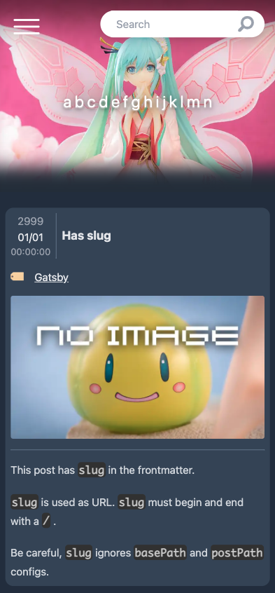
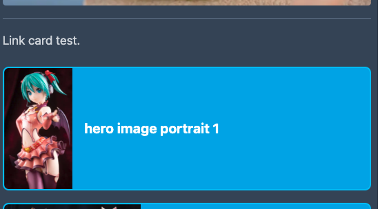
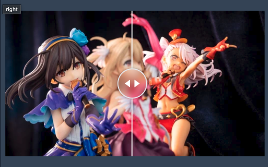

# @tenpamk2/gatsby-theme-figure-blog



The simple blogging theme that is suitable for figure photographs.

## Demo

🚧WIP🚧

## Features

- Make your photos look as large as possible.
- Responsive
- Hero image support
  - If it's portrait, focus (crop) on the top side because the figure's face is usually there❗
- Pure Markdown not MDX
- [Special hooks](#special-hooks)
- Code highlighting by [prism.js](https://prismjs.com/)
- Dark Mode only
- Tags, archives page support
- Cards layout support in tags and archives page
- pagination
- Debug and playground page support

## Special hooks

Some Markdown under special conditions are converted to special components.

### Post link cards of internal links

Convert top-level internal link in your Markdown to post-link-card.
The card has hero-image of linked post (or page), so looks so good❗

For example, when you write the following Markdown,

```md
Link card test.

[Portrait test](/test-posts/hero-image-portrait-1/)
```

you will get post-link-card like the below.

;

This hook works under the following conditions

- The link must be at the top level.
  - For example, the links in the blockquote does not converted.
- The link must be alone in a paragraph.
  - For example, the links surrounded some texts does not converted.
- The link is not an image link.

### Image compare slider

Convert 2 images that have special `title` to image-compare-slider
by [react-compare-slider](https://github.com/nerdyman/react-compare-slider) .
This is very helpful when you want to show interactive compare slider for your site visitors❗

For example, when you write the following Markdown,

```md


```

you will get image-compare-slider like the below.

;

This hook works under the following conditions

- The paragraph that includes `left` and `right` images must be at the top level.
- The title of images starts with `left` or `right` .
- `left` and `right` images exist and are in same paragraph.
  - This means that you cannot insert blank lines between 2 images in Markdown.

## Installation

```sh
npm install @tenpamk2/gatsby-theme-figure-blog
```

### Install as a starter

🚧WIP🚧

## Usage

### `siteMetadata`

| Key                | example                               | Description                                     |
| :----------------- | :------------------------------------ | :---------------------------------------------- |
| `title`            | `'My Blog'`                           | Title of your blog.                             |
| `description`      | `'The blog about japanese figure!!'`  | Description of your blog.                       |
| `siteUrl`          | `'https://your-blog.com'`             | Origin of your blog. Do not end with `/` .      |
| `author.name`      | `'your name'`                         | Author name. This is shown in bio sidebar.      |
| `author.summary`   | `'I'm a software engineer in Japan.'` | Author summary. This is shown in bio sidebar.   |
| `social.twitter`   | `'@youraccount'`                      | Twitter acount. Leave it blank if not needed.   |
| `social.instagram` | `'your_account'`                      | Instagram acount. Leave it blank if not needed. |
| `social.github`    | `'yourAccount'`                       | GitHub acount. Leave it blank if not needed.    |
| `menuLinks`        | `[...]`                               | Menu links in nav-bar at top in header.         |
| `menuLinks[].name` | `'About'`                             | Link text.                                      |
| `menuLinks[].link` | `'/about/'`                           | Link.                                           |

### Theme options

| Key                              | Default Value             | Description                                                                                                   |
| :------------------------------- | :------------------------ | :------------------------------------------------------------------------------------------------------------ |
| `archivesPath`                   | `'archives'`              | URL for the archives pages.                                                                                   |
| `basePath`                       | `'base'`                  | Root url for the theme.                                                                                       |
| `cardsPerPage`                   | `12`                      | The number of cards in 1 page.                                                                                |
| `debugPath`                      | `'debug'`                 | URL for the debug page.                                                                                       |
| `externalLinks`                  | `[]`                      | External link lists info for sidebar.                                                                         |
| `externalLinks[].name`           | -                         | External link text.                                                                                           |
| `externalLinks[].url`            | -                         | External link.                                                                                                |
| `formatStringMonthAndDay`        | `'MM/DD'`                 | `formatString` for month and day.                                                                             |
| `formatStringTime`               | `'HH:mm:ss'`              | `formatString` for time.                                                                                      |
| `formatStringYear`               | `'YYYY'`                  | `formatString` for year.                                                                                      |
| `locale`                         | `'en-US'`                 | Locale.See [MDN](https://developer.mozilla.org/ja/docs/Web/JavaScript/Reference/Global_Objects/Intl/Locale) . |
| `pagesPath`                      | `'pages'`                 | URL for the pagination after 2nd pages.                                                                       |
| `playgroundPath`                 | `'playground'`            | URL for the playground page.                                                                                  |
| `postPath`                       | `'post'`                  | URL for the post page.                                                                                        |
| `postsPerPage`                   | `6`                       | The number of posts in 1 page at main page.                                                                   |
| `rssNeedFullContent`             | `false`                   | Contain full content into the field of `MarkdownPost.rssContentEncoded` for RSS.                              |
| `rssPruneLength`                 | `128`                     | The prune length of the field of `MarkdownPost.rssDescription` for RSS.                                       |
| `rssTruncate`                    | `false`                   | Truncate texts of the field of `MarkdownPost.rssContentEncoded` and `MarkdownPost.rssDescription` for RSS.    |
| `tagsPath`                       | `'tags'`                  | URL for the tags page.                                                                                        |
| `options***`                     | -                         | Plugin options. Do not set unless you understand what you are doing.                                          |
| `optionsGatsbyRemarkImages`      | (See `gatsby-config.js` ) | `gatsby-remark-images` options. You can change image quality , `max-width` or etcetc.                         |
| `optionsGatsbyTransformerRemark` | (See `gatsby-config.js` ) | `gatsby-transformer-remark` options. You can change `excerpt_separator` .                                     |

### Excample usage

See [gatsby-config.mjs of example](https://github.com/tenpaMk2/gatsby-theme-figure-blog/blob/main/example/gatsby-config.mjs) .

### Change header image

Place your image at `static/header.webp` .

### Change bio image

Place your image at `src/@tenpamk2/gatsby-theme-figure-blog/images/bio.svg` .
Or, shadow `bio-icon.js` by placing it at `src/@tenpamk2/gatsby-theme-figure-blog/components/bio-icon.js` .

### Change placeholder image

Place your image at `src/@tenpamk2/gatsby-theme-figure-blog/images/no-image.png` .

## Credits

|            Item             | Link                                                                           |
| :-------------------------: | :----------------------------------------------------------------------------- |
| Magnifying Glass SVG Vector | [Icooon Mono in SVG Repo](https://www.svgrepo.com/svg/479944/magnifying-glass) |
|  Twitter Boxed SVG Vector   | [instructure-ui in SVG Repo](https://www.svgrepo.com/svg/501411/twitter-boxed) |
|      Github SVG Vector      | [scarlab in SVG Repo](https://www.svgrepo.com/svg/508076/github)               |
|    Instagram SVG Vector     | [Iconsax in SVG Repo](https://www.svgrepo.com/svg/497210/instagram)            |
|       Menu SVG Vector       | [Iconsax in SVG Repo](https://www.svgrepo.com/svg/497274/menu)                 |
|   Close Circle SVG Vector   | [Iconsax in SVG Repo](https://www.svgrepo.com/svg/496952/close-circle)         |
